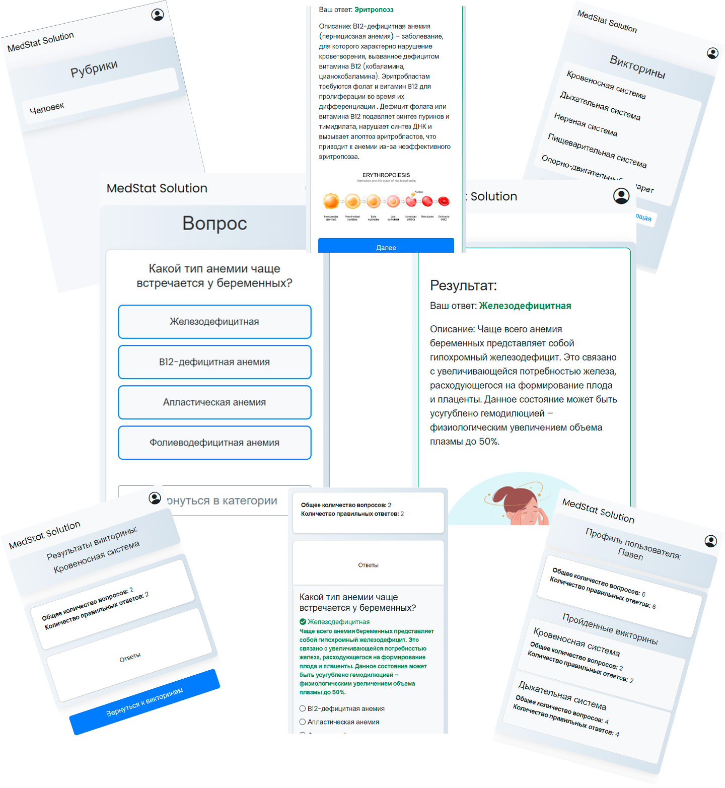
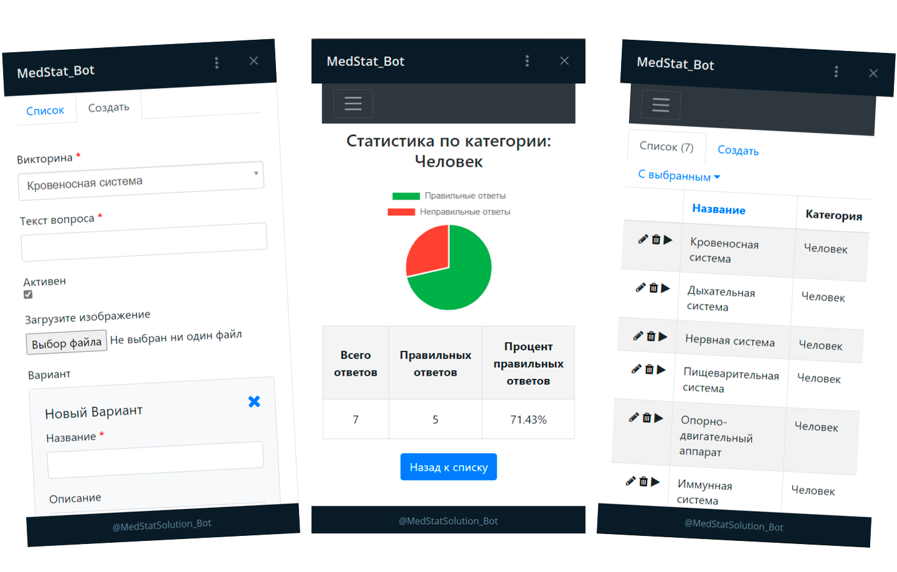

# ТЕЛЕГРАММ-БОТ ДЛЯ ПРОВЕДЕНИЯ ВИКТОРИН С ИСПОЛЬЗОВАНИЕМ WEB APPS

# Описание проекта

## 📖 О проекте

Телеграмм-бот, позволяющий пользователям проходить интерактивные викторины с использованием Web Apps. Проект разработан для того, чтобы предоставить пользователям удобный способ получения знаний и тестирования своих навыков через викторины по различным тематикам. Пользовательская часть реализована в виде бота, который предлагает пользователям вопросы и варианты ответов, а по завершению предоставляет результаты. Проект также включает административную панель, через которую можно управлять рубриками, викторинами и вопросами, а также отслеживать статистику прохождений.

Основные функции проекта:

- **Прохождение викторин**: пользователи могут выбирать рубрики и проходить викторины, отвечая на вопросы с несколькими вариантами ответов.
- **Анализ результатов**: бот сохраняет результаты каждого пользователя и предоставляет возможность их просмотра после завершения викторины.
- **Административная панель**: администраторы могут управлять рубриками, викторинами, добавлять и редактировать вопросы, а также просматривать статистику ответов.
- **Статистика**: отображение результатов и статистики по каждой рубрике и викторине, включая количество правильных и неправильных ответов.
- **Профиль пользователя**: возможность просмотра истории пройденных викторин и результатов в личном профиле.

Проект идеально подходит для образовательных целей, а также для проведения интерактивных тестов и опросов в различных областях знаний.




*Коллаж, демонстрирующий интерфейс бота: прохождение викторины, вопросы, ответы, результаты, административная панель и статистика.*

## Использованные технологии в проекте

             

---

## 🚀 Запуск проекта

Для запуска проекта нужно:

- В папке `/infra` создать файл `.env`.
- Заполнить файл `.env` по примеру из `.env.example`.
- Параметр `WEB_URL` должен содержать URL вашего сервера. Обязательно использовать порт, который указан в `.env` и обеспечить подключение через HTTPS.
- В той же папке `/infra` выполнить команду:

```shell
docker compose up --build
```

**Примечание**: первый пользователь, вошедший в систему, автоматически становится администратором.

### Возможные ошибки при запуске:
1. Если возникает ошибка при подключении к базе данных, необходимо либо удалить все volume в Docker, либо переименовать volume в `docker-compose` файле.
2. Если появляется ошибка с символом `'
'` в конце команды, откройте файл `command.sh` с помощью Notepad++, найдите и удалите все '\r'
`.

---

## 📂 Структура проекта

```text
MedStat_Solutions_team3/
│
├── infra/
│   ├── .env
│   ├── .env.example
│   ├── docker-compose.yml
│   └── docker-compose.production.yml
│
├── logs/
│
├── migrations/
│
├── src/
│   ├── admin/
│   ├── crud/
│   ├── instance/
│   ├── models/
│   ├── static/
│   │   ├── css/
│   │   ├── images/
│   │   └── js/
│   ├── templates/
│   │   ├── admin/
│   │   ├── csrf/
│   │   ├── errors/
│   │   └── ...
│   ├── views/
│   ├── api_views.py
│   ├── bot.py
│   ├── command.sh
│   ├── constants.py
│   ├── error_handlers.py
│   ├── jwt.py
│   ├── run_server.py
│   └── utils.py
│
├── docs/
│   ├── dir_visualization.pdf
│   ├── models_schema.pdf
│   └── webhook_report.txt
│
└── .github/
    └── workflows/
        └── ci_cd.yml
```

Проект состоит из следующих основных директорий и файлов:

### `/infra`
Содержит файлы для развертывания проекта, такие как `docker-compose.yml` и `.env` файл, необходимый для настройки окружения.

### `/logs`
Здесь хранятся лог-файлы приложения.

### `/migrations`
Миграции базы данных, необходимые для обновления схемы данных при изменении моделей.

### `/src`
Содержит основной код проекта, включая модули бота, CRUD операции, модели и обработчики ошибок.

- **`/admin`** — файлы, отвечающие за административную панель.
- **`/crud`** — CRUD классы для работы с сущностями: викторинами, рубриками, вопросами и статистикой ответов пользователей.
- **`/models`** — модели данных проекта, используемые в базе данных.
- **`/templates`** — HTML шаблоны для страниц пользователя и административной панели.
- **`/static`** — статические файлы проекта, такие как CSS, изображения и JS.
- **`/views`** — представления для обработки запросов (включая представления бота и админки).

### `/src/static`
Статические файлы проекта, включая стили, скрипты и изображения.

### `/docs`
Документация по проекту, включающая схемы, описания и объяснения по работе с системой.

### `/.github/workflows`
Файлы для автоматизации CI/CD через GitHub Actions.

---

## 👥 Участники проекта

- **Тимлид команды**: [Клищенко Павел](https://github.com/PaShyKDF)

### Авторы
- [Борисов Максим](https://github.com/Wayer5)
- [Зайцев Дмитрий](https://github.com/of1nn)
- [Клобков Павел](https://github.com/Pavel-K14)
- [Бабич Денис](https://github.com/babichdenis)
- [Ряднов Никита](https://github.com/Riadnov-dev)
